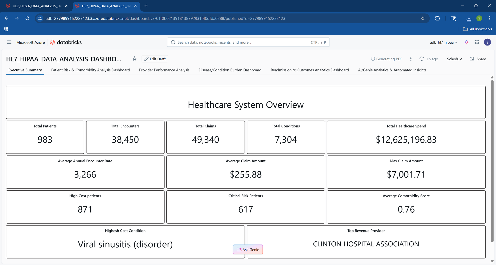
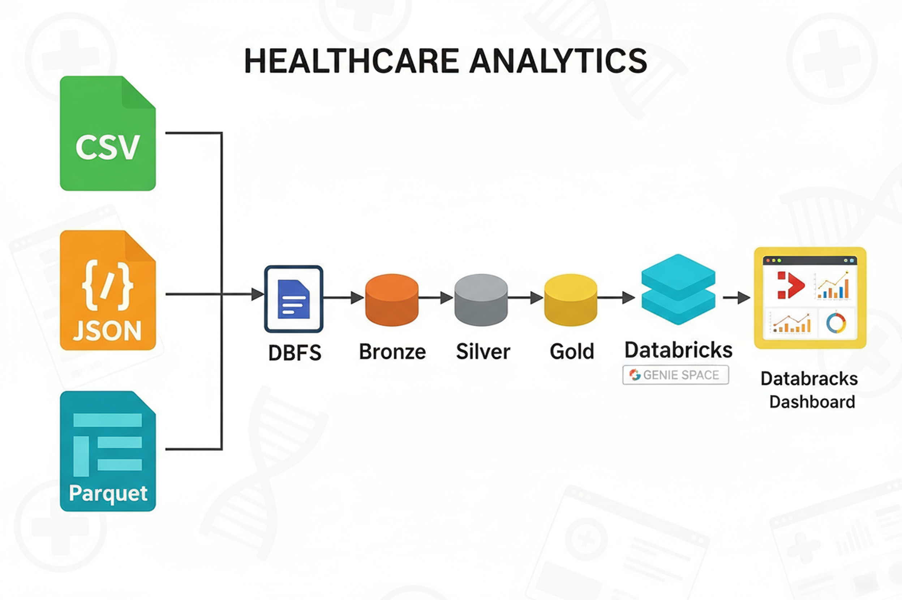
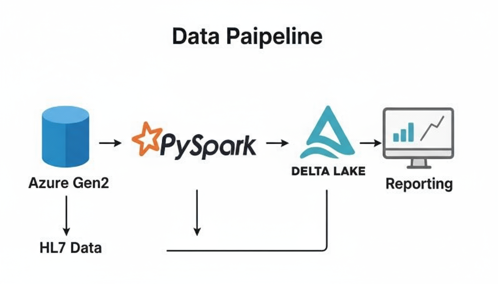
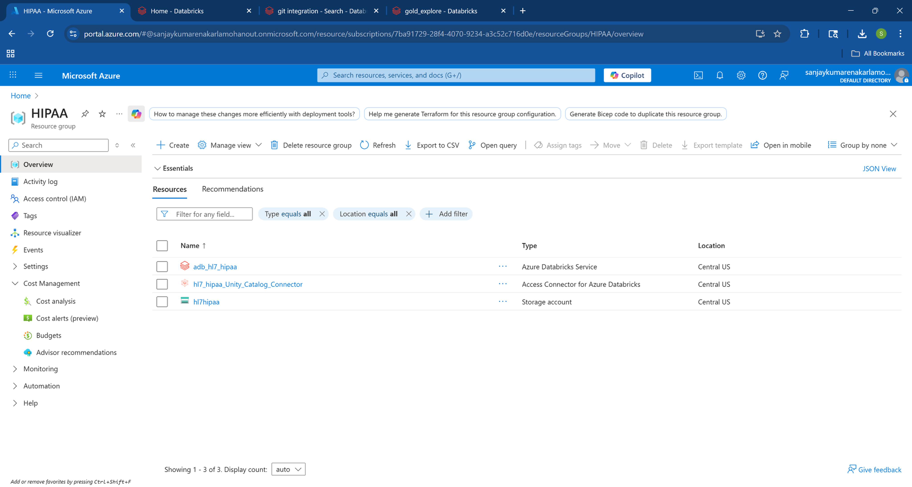
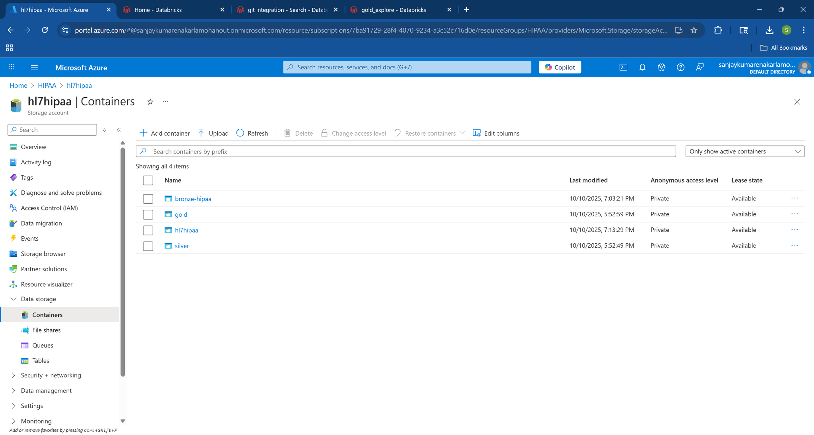
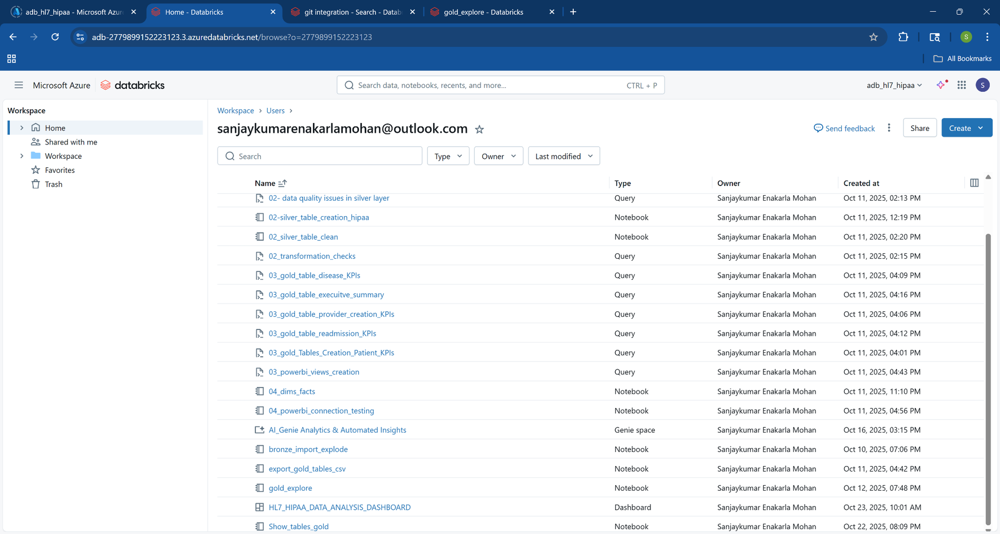
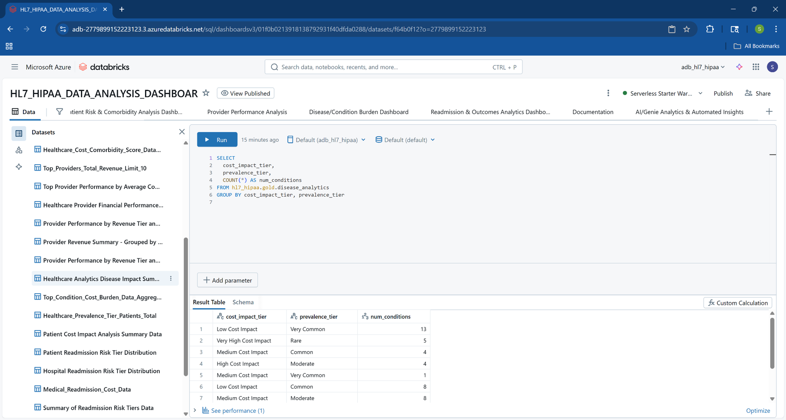

# Sanjaykumar Enakarla Mohan — Healthcare Analytics with Databricks & Azure

**LinkedIn:** [linkedin.com/in/sanjaykem](https://www.linkedin.com/in/sanjaykem)  
**Email:** sanjaykumar.em0609@gmail.com  

---

**Transforming raw HL7 datasets and financial claims into actionable population health dashboards and cost intelligence — using Databricks and Azure.**

---

## Table of Contents
- [About Me](#about-me)
- [Sample Project Scenarios](#sample-project-scenarios)
- [Executive Dashboard](#executive-dashboard)
- [Architecture and Cloud Setup](#architecture-and-cloud-setup)
- [Analytics and Insight Dashboards](#analytics-and-insight-dashboards)
- [Business Impact](#business-impact)
- [Sample Databricks Transformation Notebook](#sample-databricks-transformation-notebook)
- [Glossary](#glossary)
- [Project Artifacts and Documentation](#project-artifacts-and-documentation)
- [Contact and Links](#contact-and-links)
- [License and Dataset Attribution](#license-and-dataset-attribution)

---

## About Me

**Data & BI Analyst.**  
5+ years driving value with SQL, Python, Databricks, Azure, and Power BI — blending banking and healthcare analytics.  
Skilled in ETL, reporting automation, dashboarding, stakeholder communication, and statistical modeling.

- **Recent focus:** Healthcare data integration, population health dashboarding, Delta Lake pipelines, risk/comorbidity analytics.
- **Certifications:** Microsoft Power BI Data Analyst (PL-300), Databricks Fundamentals, Google Data Analytics

---

## Sample Project Scenarios

### Scenario 1: HL7 Claims ETL & Population Health Insights

**Challenge:**  
Enable high-granularity, regulatory-grade analytics on large HL7-format claims for population and risk stratification.

**Solution:**  
- Built Bronze/Silver/Gold multi-layer pipelines in Databricks, using Delta Live Tables, PySpark, and automated ingestion.
- Automated risk/cost aggregation and cleaning for real-time dashboards.

**Impact:**  
- Catagorized $8M in critical patient spend, prioritizing interventions
- 3x faster risk analytics and compliance audits

**Stack:**  

---

## Executive Dashboard

**[Download PDF: Executive_Summary_Dashboard.pdf](screenshots/Executive_Summary_Dashboard.pdf)**

| KPI                        | Value                  |
|----------------------------|------------------------|
| **Total Patients**         | 983                    |
| **Total Encounters**       | 38,450                 |
| **Total Claims**           | 49,340                 |
| **Healthcare Spend**       | $12,625,196.83         |
| **High Cost Patients**     | 871                    |
| **Critical Risk Patients** | 617                    |
| **Max Claim Amount**       | $7,001.71              |
| **Top Provider**           | CLINTON HOSPITAL ASSOC |
| **High Cost Condition**    | Viral sinusitis        |

---

## Architecture and Cloud Setup

- **Medallion Architecture (Bronze/Silver/Gold, Delta Lake)**
- **End-to-End HL7 Dataflow:**  
  
- **ETL Pipeline Visualization:**  
  
- **Azure Resource Groups & Storage:**  
  
  
- **Databricks Workspace Sample:**  
  

---

## Analytics and Insight Dashboards

### Provider Performance  
- [Provider Performance Analysis PDF](screenshots/Provider_Performance_Analysis.pdf)
### Patient Risk and Comorbidity  
- [Patient Risk & Comorbidity Analysis PDF](screenshots/Patient_Risk_Comorbidity_Analysis_Dashbboard.pdf)
### Disease and Condition Burden  
- [Condition Burden Dashboard PDF](screenshots/Disease_Condition_Burden_Dashboard.pdf)
### Readmission and Outcomes  
- [Readmission Outcomes Dashboard PDF](screenshots/Readmission-Outcomes-Analytics-Dashboard.pdf)
### Analytics Dataset Example  

---

## Business Impact

- Enabled population health executives to allocate spend/risk resources with 3x more efficiency.
- Automated critical patient risk alerts, accelerating clinical interventions.
- Supported compliance and audit with Delta-backed ETL and traceable data quality checks.

---

## Sample Databricks Transformation Notebook

# Clean HL7 claims and aggregate patient spend
df = raw_df.filter(raw_df.claim_status == "Valid")
agg = df.groupBy("patient_id").agg(sum("total_spend").alias("patient_spend"))
display(agg.orderBy(desc("patient_spend")))

---

## Glossary

- **HL7:** Healthcare messaging & data standard
- **Delta Lake:** Databricks multi-tier table storage for bronze/silver/gold
- **Critical Risk Patient:** Flagged for both high spend and high readmission risk

---

## Project Artifacts and Documentation

**Download Dashboards:**
- [Executive Summary PDF](screenshots/Executive_Summary_Dashboard.pdf)
- [Provider Performance PDF](screenshots/Provider_Performance_Analysis.pdf)
- [Risk & Comorbidity PDF](screenshots/Patient_Risk_Comorbidity_Analysis_Dashbboard.pdf)
- [Condition Burden PDF](screenshots/Disease_Condition_Burden_Dashboard.pdf)
- [Readmission Outcomes PDF](screenshots/Readmission-Outcomes-Analytics-Dashboard.pdf)

**Sample Workspace Structure:**  

[Full GitHub Repository](https://github.com/EMSanjaykumar/healthcare-analytics-databricks-portfolio)

---

## Contact and Links

- **Name:** Sanjaykumar Enakarla Mohan
- **LinkedIn:** [linkedin.com/in/sanjaykem](https://www.linkedin.com/in/sanjaykem)
- **Email:** sanjaykumar.em0609@gmail.com

---

## License and Dataset Attribution

_This portfolio is for demonstration and educational purposes only.  
Data based on [Kaggle FHIR/HL7 Sample Dataset](https://www.kaggle.com/datasets/drscarlat/fhir-1ksample) — strictly de-identified and adapted for public analytics._  
_No PHI/PII is used._

---

